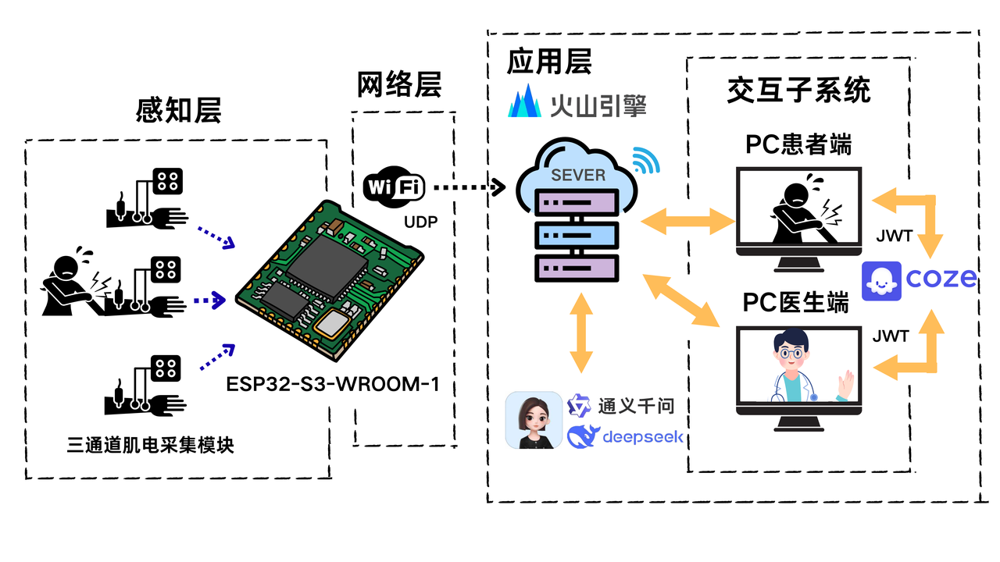

<p align="right"> 
  <a href="./README.md">中文</a> | <a href="./README_en.md">English</a>
</p>

# Semg_ELIRA

**ELIRA**（Electromyography and Large Model Driven Intelligent Rehab AI Agent System）——基于肌电信号的智能康复辅助系统

Vue 架构前端 + Flask 架构后端 + ESP32 & Arduino 肌电采集硬件

---

## 目录
1. [系统简介](#系统简介)
2. [演示图示](#演示图示)
3. [功能](#功能)
4. [需求环境](#需求环境)
5. [文档资料](#文档资料)
6. [发布与支持平台](#发布与支持平台)
7. [安装与部署流程](#安装与部署流程)
8. [许可证](#许可证)
9. [模块简介](#模块简介)

---

## 系统简介
本项目旨在构建一套智能化、多端协同的康复辅助训练系统，面向大众用户，尤其适用于学生、上班族、术后轻度训练者与亚健康人群。  
系统融合 **肌电采集、物联网通信、大模型驱动、云端智能分析与多模态交互引导** 于一体，借助 AI Agent 实现全流程智能化管理。

系统流程简述：
1. 用户佩戴肌电采集器，系统检测佩戴状态与信号强度，确保训练安全。
2. 用户通过前端（Vue 网页或 App）选择 AI 助手（DeepSeek、通义千问、豆包）并启动训练。
3. 前端播放训练动作视频并提供语音提示。
4. 肌电信号经 Arduino 采集、ESP32 传输至云端。
5. 云端调用大模型制定个性化训练方案并实时评估动作质量。
6. 每轮训练结束后生成图文评估报告，用户可在前端或 App 查看。

---

## 演示图示
### 系统总体架构图
<div align="center">
  
</div>

### 感知层架构
<div align="center">
  
</div>

### 控制层架构
<div align="center">
  
</div>

### 网络层架构
<div align="center">
  
</div>

---

## 功能
- 实时肌电数据采集与上传
- 穿戴状态检测（信号强度与接触质量）
- AI 驱动的个性化训练方案生成（支持 DeepSeek、通义千问、豆包 等模型）
- 训练动作视频与语音提示同步播放
- 实时动作质量评估与反馈
- 每轮训练生成可视化图文评估报告
- 多端同步（Web / App / 云端）与数据存储
- 在线医生远程查看与报告分享

---

## 需求环境

### 硬件
- 3 × SEMG 肌电信号干电极传感器
- 3 × 电路板
- 1 × Arduino 单片机
- 1 × 0.91 英寸 OLED 显示屏
- 1 × ESP32-S3 主控板

### 软件
- Python 3.8+（推荐 3.10）
- Flask 框架及依赖库（见 `requirements.txt`）
- Node.js 与 Vue3（前端）
- 嵌入式：Arduino IDE / STM32CubeIDE

---

## 文档资料
- 仓库 `docs/` 目录包含：系统设计、接口文档、前端说明、硬件接线图、数据格式说明。
- 推荐阅读（本地或云端存放 PDF）：医学标准动作分类、肌电信号处理基础、相关论文（存放于 `docs/papers/`，并在 `docs/index.md` 中列出）。

---

## 发布与支持平台
- **前端**：Web（可扩展至 App）
- **后端/云端**：Flask 架构，可部署于公有云（阿里云、AWS、Azure、火山云等）或私有服务器
- **嵌入式**：支持 STM32、Arduino 及其他常见感测模块

---

## 安装与部署流程

### 1. 克隆仓库
```bash
git clone https://github.com/your-org/Semg_ELIRA.git
cd Semg_ELIRA
```

### 2. 配置后端环境
```bash
python -m venv venv
source venv/bin/activate   # Linux / macOS
venv\Scripts\activate      # Windows
pip install -r requirements.txt
```

| 建议服务器使用 CentOS 系统，并通过 mobaXterm 进行远程部署。

### 3.部署后端服务
```bash
python app.py
```

### 4. 启动前端（Web）
```bash
cd frontend
npm install
npm run build
```

### 5. 嵌入式固件

* 编译并烧录 ESP32 固件，配置网络与采集通道
* 将 Arduino 采集脚本上传并测试 ADC 输出

### 6. 验证流程

* 使用模拟脚本或硬件采集上传数据
* 访问前端或调用 API 查看分析结果与报告
## 许可证

本项目代码开源[MIT](./LICENSE)，项目文档采用 [署名-禁止演绎 4.0 国际协议许可](https://creativecommons.org/licenses/by-nd/4.0/deed.zh)

## 模块简介

1. **设备穿戴与信号校验** — 负责检测电极佩戴状态、信号强度及噪声过滤。
2. **训练准备与动作指引（待定）** — 播放训练视频、语音提示与动作计时控制。
3. **肌电采集与数据上传** — MCU/采集器端的数据采样、打包与网络传输。
4. **云端分析与个性化训练方案生成** — 核心算法模块，调用大模型生成训练计划并实时评估。
5. **康复过程实时监控与反馈** — 实时可视化、异常告警与反馈建议。
6. **康复结果总结与报告输出** — 每次训练的图文/PDF 报告导出与历史记录管理。
7. **在线医生远程分析与建议反馈** — 医生查看历史数据、远程会诊与建议发布。

## 补充

若有不足敬请指出，我们会一直进步的。
