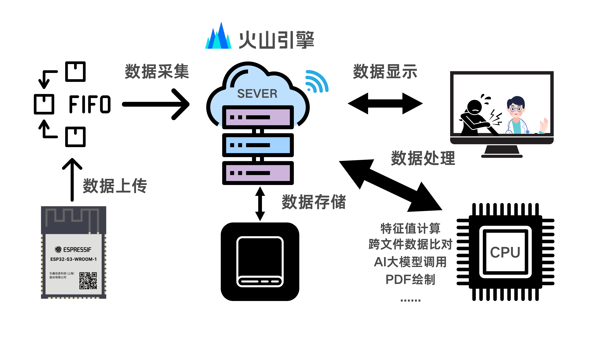

<p align="right">
  <a href="./README.md">中文</a> | <a href="./README_en.md">English</a>
</p>

# Semg\_ELIRA

**ELIRA**（Electromyography and Large Model Driven Intelligent Rehab AI Agent System）——基于肌电信号的智能康复辅助系统

Vue架构前端＋Flask架构后端

## 目录
1. [系统简介](#系统简介)
2. [演示图示](#演示图示)
3. [使用说明](#使用说明)
4. [需求（环境）](#需求环境)
5. [演示示例](#演示示例)
6. [文档资料](#文档资料)
7. [功能](#功能)
8. [发布与支持平台](#发布与支持平台)
9. [安装与部署流程](#安装与部署流程)
10. [许可证](#许可证)
11. [模块简介](#模块简介)

## 系统简介
本项目旨在构建一套智能化、多端协同的康复辅助训练系统，面向大众用户，尤其适用于学生群体和上班族、术后轻度训练者与亚健康人群。系统融合**肌电采集、物联网通信、大模型驱动、云端智能分析与多模态交互引导**于一体，借助 AI Agent 实现全流程智能化管理。

系统引导用户佩戴肌电采集器，判断佩戴状态（信号强度），确保训练安全有效。用户通过前端（Vue 网页或 App）选择 AI 助手（DeepSeek、通义千问、豆包），启动训练。前端播放训练动作视频并配有语音提示。

肌电信号由采集器放大后经 Arduino ADC 采样，传至 STM32，再上传至云端。云端部署 Python 核心模块，调用大模型制定训练计划，识别肌电动作状态，并结合医学文献中七类标准动作制定个性化辅助训练方案。

训练过程中，系统实时评估动作质量，反馈肌电特征变化，并在每轮训练后生成图文评估报告。AI Agent 作为康复小助手，帮助用户分析报告与答疑解惑。所有数据同步存储于云端，App 可实时读取。


## 演示图示
### 系统总体架构图

<div align="center">
  
</div>

### 感知层架构

<div align="center">
  
</div>

### 控制层架构

<div align="center">
  
</div>

### 网络层架构

<div align="center">
  
</div>

## 使用说明

下面给出常用使用场景与快速跳转：

* 打开前端界面（Web）: `docs/web/README.md` 或直接访问 `http://<your-host>/`。 <br/> 

* 打开移动端 App（Android / iOS）: 请参考 `docs/mobile/README.md` 并安装对应 APK / TestFlight 包。 <br/> 

* 查看云端分析控制台: `docs/cloud/console.md`。 <br/> 

> 提示：仓库中 `docs/` 目录包含详细使用手册与页面跳转说明（搜索 `快速开始` 可直接跳转）。


## 需求（环境）

**硬件**
* 3个SEMG肌电信号干电极传感器
* 3个电路板
* 1个Arduino单片机
* 1个0.91英寸OLED显示屏
* ESP32-S3单片机作为主控板

**软件（前后端）**

* Python 3.8+（推荐 3.10）
* 常用依赖：`numpy`, `scipy`, `pandas`, `matplotlib`, `torch`（若需模型推理）, `fastapi`, `uvicorn`
* 数据库（任选）：PostgreSQL / MySQL / SQLite（用于小规模测试）
* 消息队列（可选）：Redis / RabbitMQ
* 前端：Node.js 16+、Vue 3

## 演示示例

仓库中提供若干演示脚本：

* `examples/simulated_acquisition.py` — 模拟肌电数据采集并上传到云端。
* `examples/run_analysis.py` — 本地运行云端分析模块并生成报告。
* `examples/demo_frontend/` — 前端演示页面源码（可直接用 `npm run dev` 运行）。

运行快速 demo：

```bash
# 安装依赖（示例）
python -m venv venv
source venv/bin/activate
pip install -r requirements.txt

# 运行模拟采集
python examples/simulated_acquisition.py

# 在另一个终端运行分析服务
python examples/run_analysis.py
```

## 文档资料

* 仓库 `docs/` 目录包含：系统设计、接口文档、前端说明、硬件接线图、数据格式说明。
* 推荐阅读（本地或云端存放 PDF）：医学标准动作分类、肌电信号处理基础教材、相关论文 PDF（请将 PDF 放在 `docs/papers/` 并在 `docs/index.md` 列出）。

## 功能

* 实时肌电数据采集与上传
* 穿戴状态检测（信号强度与接触质量判断）
* AI 驱动的个性化训练方案生成（支持 DeepSeek、通义千问、豆包 等模型接入）
* 训练动作视频与语音提示同步播放
* 实时动作质量评估与回馈
* 每轮训练生成可视化图文评估报告
* 多端同步（Web / App / 云端）与数据存储
* 在线医生远程查看与报告分享

## 发布与支持平台

* 前端：Web（现代浏览器）, Android (APK), iOS (IPA/TestFlight)
* 后端/云端：Linux x86\_64（推荐 Ubuntu 20.04+），可部署在公有云（阿里云、AWS、Azure、火山云等）或私有服务器
* 嵌入式部分：支持常见 MCU（STM32 系列、Arduino）与感测模块

---

## 安装与部署流程（简要）

### 1. 克隆仓库

```bash
git clone https://github.com/your-org/Semg_ELIRA.git
cd Semg_ELIRA
```

### 2. 配置云端环境

* 创建 Python 虚拟环境并安装依赖：`pip install -r requirements.txt`
* 配置 `.env`（示例文件 `.env.example`）：数据库地址、模型路径、云存储凭证、第三方 API Key（如 DeepSeek）

### 3. 部署后端服务（示例）

```bash
uvicorn backend.main:app --host 0.0.0.0 --port 8000
```

### 4. 启动前端（Web）

```bash
cd frontend
npm install
npm run build    # 或 npm run dev 用于开发
```

### 5. 嵌入式固件

* 编译并烧录 STM32 固件，配置网络与采集通道
* 将 Arduino 采集脚本上传并测试 ADC 输出

### 6. 验证流程

* 使用模拟脚本或硬件采集上传数据
* 访问前端或调用 API 查看分析结果与报告

## 许可证

本项目代码开源[MIT](./LICENSE)，项目文档采用 [署名-禁止演绎 4.0 国际协议许可](https://creativecommons.org/licenses/by-nd/4.0/deed.zh)

## 模块简介

1. **设备穿戴与信号校验** — 负责检测电极佩戴状态、信号强度及噪声过滤。
2. **训练准备与动作指引（待定）** — 播放训练视频、语音提示与动作计时控制。
3. **肌电采集与数据上传** — MCU/采集器端的数据采样、打包与网络传输。
4. **云端分析与个性化训练方案生成** — 核心算法模块，调用大模型生成训练计划并实时评估。
5. **康复过程实时监控与反馈** — 实时可视化、异常告警与反馈建议。
6. **康复结果总结与报告输出** — 每次训练的图文/PDF 报告导出与历史记录管理。
7. **在线医生远程分析与建议反馈** — 医生查看历史数据、远程会诊与建议发布。

## 补充

若有不足敬请指出，我们会一直进步的。

