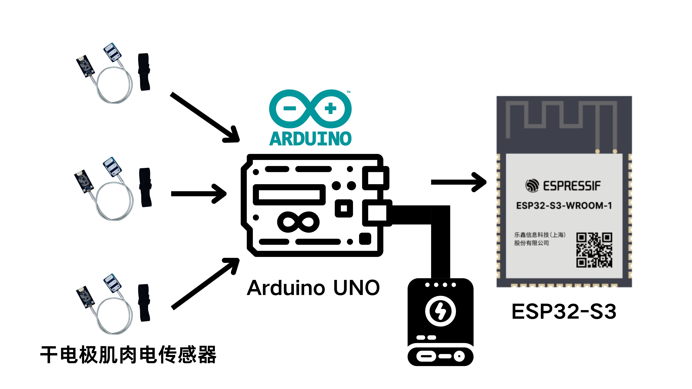

<p align="right"> 
  <a href="./README.md">中文</a> | <a href="./README_en.md">English</a>
</p>

# Semg_ELIRA

**ELIRA** (Electromyography and Large Model Driven Intelligent Rehab AI Agent System) — An intelligent rehabilitation assistance system based on EMG signals.

Vue-based frontend + Flask-based backend + ESP32 & Arduino EMG acquisition hardware.

---

## Table of Contents
1. [System Overview](#system-overview)
2. [Demonstration Diagrams](#demonstration-diagrams)
3. [Features](#features)
4. [Requirements](#requirements)
5. [Documentation](#documentation)
6. [Supported Platforms](#supported-platforms)
7. [Installation and Deployment](#installation-and-deployment)
8. [License](#license)
9. [Module Overview](#module-overview)

---

## System Overview
This project aims to build an intelligent, multi-terminal collaborative rehabilitation training system for the general public, especially suitable for students, office workers, post-surgery light training, and people with sub-health conditions.  
The system integrates **EMG acquisition, IoT communication, large-model-driven intelligence, cloud-based analysis, and multimodal interaction guidance**, leveraging an AI Agent for end-to-end intelligent management.

System workflow:
1. The user wears the EMG acquisition device; the system detects the wearing status and signal strength to ensure safe training.
2. The user selects an AI assistant (DeepSeek, Tongyi Qianwen, Doubao) via the frontend (Vue web app or mobile app) and starts training.
3. The frontend plays training action videos with voice prompts.
4. EMG signals are collected via Arduino, transmitted through ESP32 to the cloud.
5. The cloud calls a large model to generate a personalized training plan and evaluate action quality in real time.
6. After each training session, a visual report is generated, viewable via frontend or app.

---

## Demonstration Diagrams
### Overall System Architecture
<div align="center">
  
</div>

### Perception Layer Architecture
<div align="center">
  
</div>

### Control Layer Architecture
<div align="center">
  
</div>

### Network Layer Architecture
<div align="center">
  
</div>

---

## Features
- Real-time EMG data acquisition and upload
- Wearing status detection (signal strength and contact quality)
- AI-driven personalized training plan generation (supports DeepSeek, Tongyi Qianwen, Doubao, etc.)
- Synchronized playback of training videos and voice prompts
- Real-time motion quality evaluation and feedback
- Visual text-and-graph reports generated after each training session
- Multi-terminal data sync (Web / App / Cloud)
- Remote doctor viewing and report sharing

---

## Requirements

### Hardware
- 3 × SEMG dry-electrode EMG sensors
- 3 × circuit boards
- 1 × Arduino microcontroller
- 1 × 0.91-inch OLED display
- 1 × ESP32-S3 main controller board

### Software
- Python 3.8+ (3.10 recommended)
- Flask framework and dependencies (see `requirements.txt`)
- Node.js and Vue3 (frontend)
- Embedded: Arduino IDE / STM32CubeIDE

---

## Documentation
- The `docs/` directory contains: system design, API documentation, frontend instructions, hardware wiring diagrams, and data format specifications.
- Recommended reading (local or cloud-stored PDFs): standard medical action classification, EMG signal processing fundamentals, relevant research papers (store in `docs/papers/` and list in `docs/index.md`).

---

## Supported Platforms
- **Frontend**: Web (expandable to App)
- **Backend/Cloud**: Flask-based, deployable to public cloud (Alibaba Cloud, AWS, Azure, Volcano Engine, etc.) or private servers
- **Embedded**: Supports ESP32, Arduino, and other common sensing modules

---

## Installation and Deployment

### 1. Clone the repository
```bash
git clone https://github.com/your-org/Semg_ELIRA.git
cd Semg_ELIRA
```

### 2. Configure the backend environment
```bash
python -m venv venv
source venv/bin/activate   # Linux / macOS
venv\Scripts\activate      # Windows
pip install -r requirements.txt
```

### 3. Deploy the backend service
```bash
python app.py
```

### 4. Launch the frontend (Web)
```bash
cd frontend
npm install
npm run build
```

### 5. Embedded firmware
* Compile and flash STM32 firmware, configure network and acquisition channels

* Upload Arduino acquisition scripts and test ADC output

### 6. Verification process
* Use simulation scripts or hardware to collect and upload data

* Access the frontend or call the API to view analysis results and reports

## License
Project code is licensed under [MIT](./LICENSE), project documentation is licensed under [CC BY-ND 4.0 International](https://creativecommons.org/licenses/by-nd/4.0/deed.zh).

## Notes
If there are any shortcomings, please feel free to point them out. We are committed to continuous improvement.
